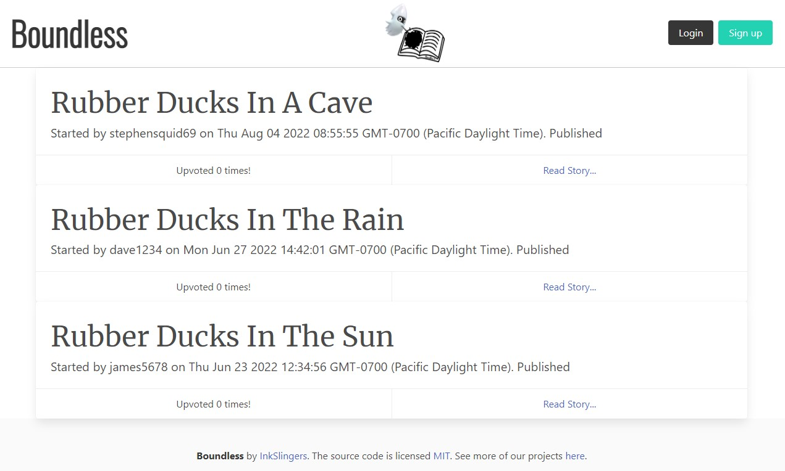

# Boundless.io

## Description

## Table of Contents
- [Example](#example)
- [Installation](#installation)
- [Usage](#usage)
- [License](#license)
- [Contributing](#contributing)
- [Tests](#tests)
- [Questions](#questions)

## Example
[Website Link](https://boundless-stories.herokuapp.com/)

## Installation
No installation is required. Just come visit our website and start writing!

## Usage

## License
Licensed under the [MIT](https://opensource.org/licenses/MIT) license.

## Contributing
Contribution inquiries can be sent through the Github or the email in the [questions](#questions) section. We are open to any suggestions.

## Tests
Tests were conducted by running the program locally for the front-end elements and Insomnia to test our back-end calling.

## Credits
- [Shields.io](https://shields.io/)
- [Github Gist: rxaviers](https://gist.github.com/rxaviers/7360908)

## Questions
Please contact us below for further questions:

:octocat: Github username:
- [abrowncownow](https://github.com/abrowncownow)
- [LonelyMitoc](https://github.com/LonelyMitoc)
- [dberry38](https://github.com/dberry38)
- [DevSteph0](https://github.com/DevSteph0)

:e-mail: Email:
- abrowncownow@gmail.com
- jamesmatsu@gmail.com
- davidberry38@gmail.com
- stephenounisapanda@gmail.com